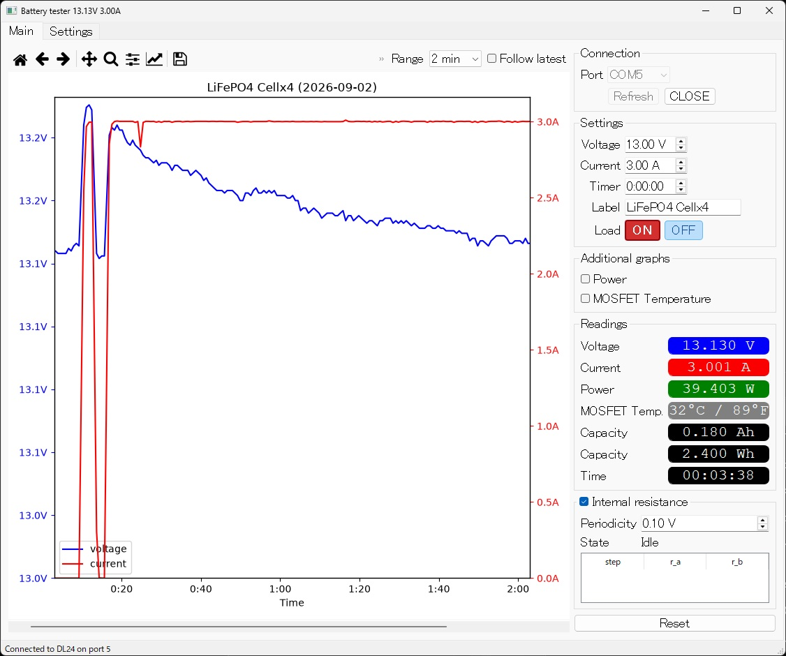

# Electronic_load_DL24



Python software for the Atorch DL24 electronic load.

This repository is a personal fork of [Jay2k1/Electronic_load_DL24](https://github.com/Jay2k1/Electronic_load_DL24), which itself was forked from [misdoro/Electronic_load_px100](https://github.com/misdoro/Electronic_load_px100).

[日本語](README.ja.md)

# Binary protocol

See the [v2.70 binary Protocol description](protocol_PX-100_2_70.md)

# Control software

### Main features

- Control load voltage cutoff, current, timer, and ON/OFF
- Voltage and current plot vs time (power and MOSFET temperature can also be plotted)
- Selectable graph time window, follow-latest, and horizontal scroll
- Save logs to CSV at exit and at device reset
- Internal resistance measurement at user-defined voltage steps
- Software-defined CC-CV discharge to speed up capacity tests for low current discharge

### Changes in this fork

Compared with [Jay2k1/Electronic_load_DL24](https://github.com/Jay2k1/Electronic_load_DL24):

- Start disconnected. Pick a serial port and press **OPEN** (do not auto-open the first port)
- **CLOSE** / **Refresh** for the serial connection
- Graph time axis uses elapsed session time, not the device's internal clock
- Time range: 30 s, 1 min, 2 min, 5 min, 15 min, 30 min, 1 h, 2 h, 4 h, All (default All)
- **Follow latest** and a scrollbar under the graph to review earlier data
- Load control is **ON** (red) / **OFF** (blue) buttons; appearance follows the device state
- Voltage and current spinners step by 0.1 V / 0.1 A
- Power and MOSFET temperature graphs are off until enabled
- White text on the black capacity and time reading fields
- Persist window layout, last serial port, and graph range in a local `.settings` file (ignored by git). If the saved port is missing, none is selected
- Console debug output is off by default; use `-v` / `--verbose` to enable it
- Fix crash on newer pandas (`DataFrame._append` removed)

### Changes in Jay2k1's fork (compared to misdoro/Electronic_load_px100)

- Power (W) and MOSFET temperature (°C) in the sidebar readings
- Power and MOSFET temperature plots with extra Y-axes
- Visibility toggle for those extra graphs
- Cell label used as the graph title
- Tight layout for the graph
- Combined graph legends

# Running

## Windows (batch files)

Double-click in this folder:

1. `windows_setupenv.bat` — checks Python / pip / venv, creates `.venv`, installs `requirements.txt`
2. `windows_runapp.bat` — starts the app with the venv Python

Run setup once (or again after `requirements.txt` changes). After that, use `windows_runapp.bat`.

## Command line (Windows, Linux, macOS)

Use a virtual environment (recommended):

1. Install Python 3 (developed with 3.12; 3.8+ should work)
2. Clone the repo and open a terminal in this folder
3. Create and activate a venv, then install dependencies:

```text
python -m venv .venv

# Windows
.venv\Scripts\activate

# Linux / macOS
source .venv/bin/activate

python -m pip install --upgrade pip
python -m pip install -r requirements.txt
```

4. Start the application (with the venv still active):

```text
python main.py           # quiet console
python main.py -v        # debug traces (protocol, samples, …)
python main.py --verbose
python main.py -h
```

On first launch there is no `.settings` file. Closing the window writes `.settings` next to `main.py`. The next start restores the last port (if it still exists), graph range, window size, and related UI state.

# Disclaimer

This is a personal fork for local use. It is not a maintained product, and there are no packaged installers.
